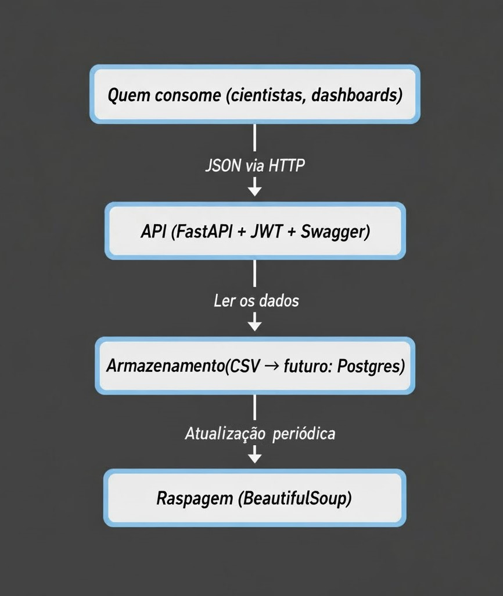

# Documentação da Arquitetura do Projeto

Este documento descreve como organizei a solução para o Tech Challenge, desde a extração dos dados até a API que disponibiliza tudo pra consulta.

---

## Como funciona o fluxo de dados:

### 1. Extração dos dados (Web Scraping)

Usei o site **books.toscrape.com** como fonte. Esse site é bem simples, não usa JavaScript pra carregar o conteúdo, então deu pra usar o BeautifulSoup sem complicação.

O script `scraper_books.py` faz o seguinte:
- Acessa as páginas do site
- Extrai informações de cada livro: título, preço (em libras), nota (de 1 a 5 estrelas), disponibilidade e categoria
- Salva tudo num arquivo CSV chamado `livros_completo.csv` na pasta `data/`

Os dados do scraping são armazenados em um arquivo CSV local, conforme solicitado no projeto. Para futura escalabilidade, seria possível migrar para um banco PostgreSQL ou outro formato, mas nesta fase o formato CSV é obrigatório.

---

### 2. API para consultar os dados

Desenvolvi a API usando **FastAPI** porque é rápido, tem validação automática com Pydantic e já gera a documentação (Swagger) sozinho.

O arquivo principal é o `api/main.py`, e criei os seguintes endpoints:

**Autenticação:**
- `POST /api/v1/auth/login` - gera o token JWT
- `POST /api/v1/auth/refresh` - renova o token quando expira

**Consulta de livros:**
- `GET /api/v1/books` - retorna todos os livros
- `GET /api/v1/books/{id}` - busca um livro específico pelo ID
- `GET /api/v1/books/search` - busca por título ou categoria
- `GET /api/v1/books/top-rated` - livros com as melhores avaliações
- `GET /api/v1/books/price-range` - filtra por faixa de preço

**Categorias:**
- `GET /api/v1/categories` - lista todas as categorias disponíveis

**Estatísticas:**
- `GET /api/v1/stats/overview` - resumo geral dos dados
- `GET /api/v1/stats/categories` - estatísticas por categoria

**Para Machine Learning:**
- `GET /api/v1/ml/features` - retorna os dados formatados pra usar como features
- `GET /api/v1/ml/training-data` - dataset pronto pra treinar modelos
- `POST /api/v1/ml/predictions` - recebe features e retorna predições

**Administração:**
- `POST /api/v1/scraping/trigger` - dispara o scraping manualmente (requer autenticação admin)

**Monitoramento:**
- `GET /api/v1/health` - verifica se a API e os dados estão funcionando

A documentação interativa fica disponível em `/docs` (Swagger) e `/redoc`.

---

### 3. Quem pode usar essa API

A ideia é que cientistas de dados, analistas e sistemas de recomendação possam consumir esses dados facilmente. Todas as respostas são em JSON. A API é aberta para consultas, exigindo autenticação JWT apenas para endpoints administrativos como disparo manual do scraping.

---

## Pensando em escalabilidade

Nesse momento, a solução é bem simples: CSV + FastAPI rodando localmente. Mas a estrutura já tá pronta pra evoluir quando precisar.

### Como a arquitetura está organizada



---

## Tecnologias Utilizadas

| Categoria | Tecnologia | Versão | Uso |
|-----------|------------|--------|-----|
| **Backend** | Python | 3.11+ | Linguagem principal |
| | FastAPI | 0.104+ | Framework web |
| | Uvicorn | 0.24+ | ASGI server |
| **Scraping** | BeautifulSoup4 | 4.12+ | Parser HTML |
| | Requests | 2.31+ | HTTP client |
| **Auth** | python-jose | 3.3+ | JWT |
| **Logs** | python-json-logger | 2.0+ | Logs estruturados |
| **Data** | CSV | - | Armazenamento |
| **Docs** | Swagger/OpenAPI | - | Auto-gerado FastAPI |

---

### Evoluções planejadas

**Armazenamento:**
- Agora: CSV (simples e funcional)
- Depois: PostgreSQL (melhor pra queries e volume maior)
- Futuro: Data Lake (S3) + Data Warehouse (Redshift ou BigQuery) se o projeto escalar muito

**API:**
- Agora: FastAPI rodando com Uvicorn
- Depois: Colocar num container Docker
- Futuro: Deploy com load balancer, auto-scaling (Kubernetes) e cache (Redis)

**Scraping:**
- Agora: Rodo manualmente ou via cron job
- Depois: Automatizar com Apache Airflow
- Futuro: Pipeline de ETL em tempo real (Kafka + Spark)

---

## Exemplos de uso pra cientistas de dados

### Exemplo 1: Análise exploratória

Quem quiser analisar a distribuição de preços por categoria pode fazer assim:

```python
import requests
import pandas as pd

# Faz login e pega o token
response = requests.post("https://minha-api.com/api/v1/auth/login", 
                         json={"username": "user", "password": "pass"})
token = response.json()["token"]

# Busca todos os livros
headers = {"Authorization": f"Bearer {token}"}
livros = requests.get("https://minha-api.com/api/v1/books", headers=headers).json()

# Converte pra DataFrame e analisa
df = pd.DataFrame(livros)
df.groupby("categoria")["preco"].describe()
```

### Exemplo 2: Sistema de recomendação

Um time de ML poderia:
1. Puxar os dados diariamente pela API
2. Fazer feature engineering (ex: TF-IDF nos títulos, embeddings das categorias)
3. Treinar um modelo de recomendação (collaborative filtering ou content-based)
4. Usar essa mesma API como feature store pro modelo em produção

### Exemplo 3: Monitorar variação de preços

Dá pra configurar um job que:
1. Roda o scraping todo dia
2. Compara os preços com o histórico
3. Detecta anomalias (tipo, preço subiu 20% do nada)
4. Envia alerta por webhook ou email

---

## Integrando com Machine Learning

### O que tá funcionando agora

A API já entrega dados limpos e prontos pra usar. Cientistas podem puxar tudo via endpoints autenticados e jogar direto em notebooks (Jupyter, Colab, etc). A documentação do Swagger ajuda bastante a explorar os dados.

### Escalabilidade para próximas fases (caso esse projeto tivesse continuidade)

**Fase 2 - Feature Store:**
Adicionar um endpoint específico pra servir features pré-processadas, com versionamento dos datasets pra garantir reprodutibilidade. Implementar cache, importante pra features que são consultadas com frequência.

**Fase 3 - Servir modelos:**
A ideia é integrar um modelo treinado na própria API e ter um endpoint `/predictions` que recebe features e retorna predições em tempo real. Logs das predições vão ajudar a melhorar o modelo no futuro.

**Fase 4 - MLOps:**
Pipeline completo de CI/CD pra retreinar o modelo automaticamente, monitorar drift de dados, fazer A/B testing e usar ferramentas como MLflow pra registrar experimentos.

### Tecnologias que fazem sentido

Pra evoluir com ML, essas tecnologias se encaixam bem:

- **Pandas e Scikit-learn** - manipulação de dados e feature engineering
- **DVC** - versionamento de datasets e modelos
- **FastAPI + pickle/joblib** - servir predições via API
- **Prometheus + Grafana** - monitorar performance do modelo
- **Apache Airflow** - agendar retreinamento

Essas escolhas batem com o que foi ensinado nas aulas e facilitam a manutenção.
